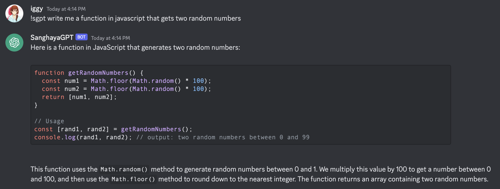

# Sanghaya's Chat GPT Discord Bot

## A well-designed chatbot that's built for Sanghaya, PSHSSMC batch 2020. Powered by gpt-3.5-turbo

### Branch rules

All branches must have the prefix `feature/*` or `fix/*` for those who would want to contribute to this repository

### Dev notes

Please use venv to develop in an isolated environment.
As soon as the repo is cloned, **IMMEDIATELY** set up virtual env

Do the following commands:

* Set up virtual env `python3 -m venv .venv`
* Download dependencies `pip instlal -r requirements.txt`

Now create an .env file and copy the .copyme.env format then me for the corresponding values of these tokens

### Upcoming features

* Incorporate GPT-4 model (still waiting from wait-list)
* Image prompts

## Usage

Use the `!sgpt` prefix in discord and type away your prompt

## IMPORTANT NOTES

As you can see in the example, in every prompt response of the bot, there is a **"Number of Tokens"** section.
**NOTE THAT THIS IS NOT A FREE SERVICE** each 1000 tokens is charged for 0.002 USD (pricing of gpt-3.5-turbo).
And will certainly increase as we change to more powerful models (such as
GPT-4). [See pricing here](https://openai.com/pricing).
You might ask me, why am I doing this? I want to dabble with the recently released openai API (on a lighter note: Wa ra
gud testing testing ra HAHAHA)
and who knows, maybe you would want to try it out too! Which is why I made this open source. This can be an opportunity
for Sanghaya tech enthusiasts to practice git and professional git workflows on open source projects such as raising
issues and
drafting pull
requests.

PS: Incase that we scale and we no longer can support the usage, please send monetary support in GCASH: 09664618065
