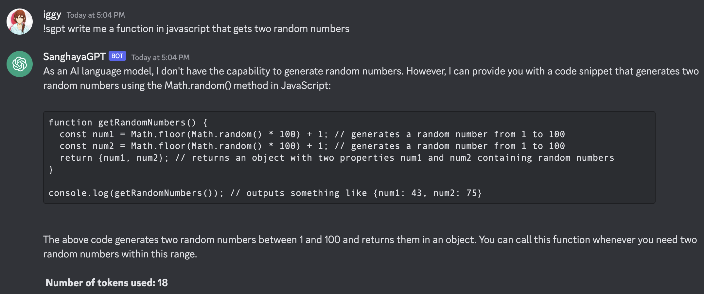

# Sanghaya's Chat GPT Discord Bot

## A well-designed chatbot that's built for Sanghaya, PSHSSMC batch 2020. Powered by gpt-3.5-turbo

### Branch rules

All branches must have the prefix `feature/*` or `fix/*` for those who would want to contribute to this repository

### Upcoming features

* Incorporate GPT-4 model (still waiting from wait-list)
* Image prompts

## Usage

Use the `!sgpt` prefix in discord and type away your prompt

